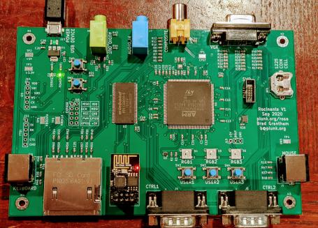
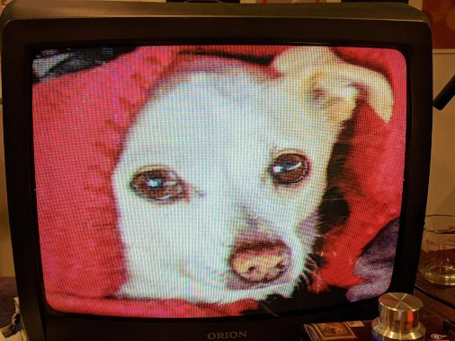
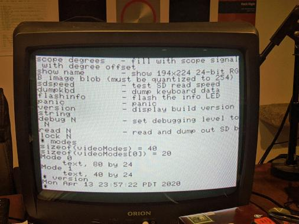
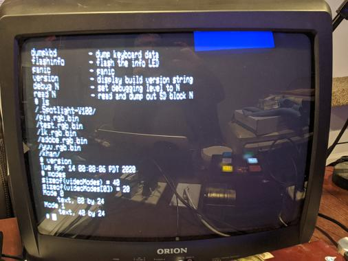

# Introduction

I wired up a microcontroller on a protoboard to display video on a vintage CRT TV.

I call it Rocinante.

It's named after Don Quixote's horse in the novel by Miguel de Cervantes. Quixote is proud of his horse and views Rocinante as his noble steed that carries him boldy into battle.  Like Don Quixote, Rocinante is actually awkward, past his prime, and engaged in a task beyond his capabilities.

I reached the limit of what I could do comfortably on a protoboard, so I designed a PCB with the peripherals I thought I might need for a beefy version of the thing.  I had PCBWay make the boards and place the SMD parts.  The boards arrived November 4th, 2020.  I installed the through-hole parts myself.

# Hardware Features
* STM32H743IITX
* Power LED, debug LED, and RESET button
* BOOT button to reset into DFU mode
* 10-pin SWD (serial wire debugging) header
* USB connector for programming/device/host
* NTSC Composite video output
* Stereo audio output
* 3 "USER" buttons
* 3 programmable RGB LEDs (WS2812B aka "NeoPixel") and 3-pin header for chaining more
* Stereo audio input (untested)
* 2x PS/2 input (mouse, keyboard) (untested)
* 16-bit (R5G6B5) VGA output (untested)
* 166MHz 16MByte SDRAM (untested)
* 8-pin header compatible with ESP-01 for wireless (untested)
* SD card (untested)
* Expansion header with SPI and 2 GPIO
* I2S header

I'm keeping a spreadsheet of [the status of hardware features](https://docs.google.com/spreadsheets/d/15A8a8_nsbp0DDcee_6BzvSB4MXrgqT0VfsGb4YH8E2E/edit#gid=0) as I bring them up.

I'm keeping rework notes for Rev1 in [rework.md](rework.md).

# The Fundmental Idea

There is no framebuffer, per se, in Rocinante.

Instead, there are two scanline buffers, and the CPU fills the next scanline buffer while DMA is scanning out the current scanline buffer.

Modern microcontrollers have high capabilities (the STM32H7 runs at 480MHz and has an FPU including double floats).  Embedded SRAM remains expensive, however, so most of the STM32 series doesn't contain enough RAM to display e.g. double-buffered 640x480 with 8-bit pixels.

This implementation trades CPU for memory and generates video data on-the-fly (aka "racing the beam") from a handful of different video formats at the time of writing:

* 1, 2, 4, and 8-bit palettized pixmaps
*  Monochrome text
* A "Wolfenstein"-style ray-casting maze renderer
* A display made of multiple run-length-compressed gradient spans per scanline

The current hardware supports a composite video display using NTSC output on an 8-bit DAC.  The pixel clock is 4x the color burst frequency, so typical console displays of the 1970's and 1980's should be almost directly representable.  Because the data is generated one scanline ahead and some CPU capacity is left over per scanline for apps, the latency for processing can be as low as one scanline.

Applications currently include a PPM viewer, PCM audio player, rudimentary 3D model viewer, and a very limited command shell.

I originally designed this with emulation of the Apple ][, ColecoVision, and Atari 2600 in mind, but who knows if I'll ever find the time for those!

# The Vision

## Hardware

On the PCB I also laid out a bunch of pie-in-the-sky features without knowing they would work.

The protoboard version used SPI to talk to an SD card.  The PCB wires an SD slot to the actual SDMMC signals on the STM32H7.

There's a 15-pin VGA header, two PS/2 jacks, and stereo audio input to give it some better media capabilities.

I daydreamed a system capable of running multiple simultaneous apps and installed 16 megabytes of SDRAM.

## Pipe Dream

Over time I hope I can make most of the system function.  If there's something that doesn't work but a fix is clear, maybe I'll spin a second rev of the board if I don't lose interest before then.
